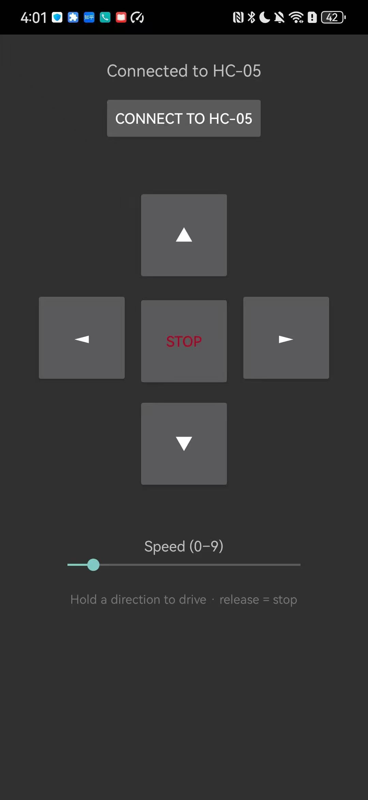
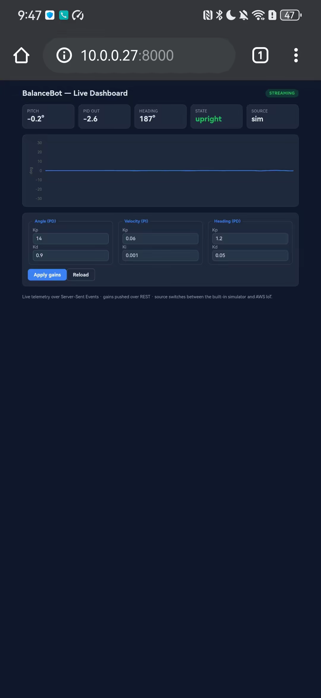
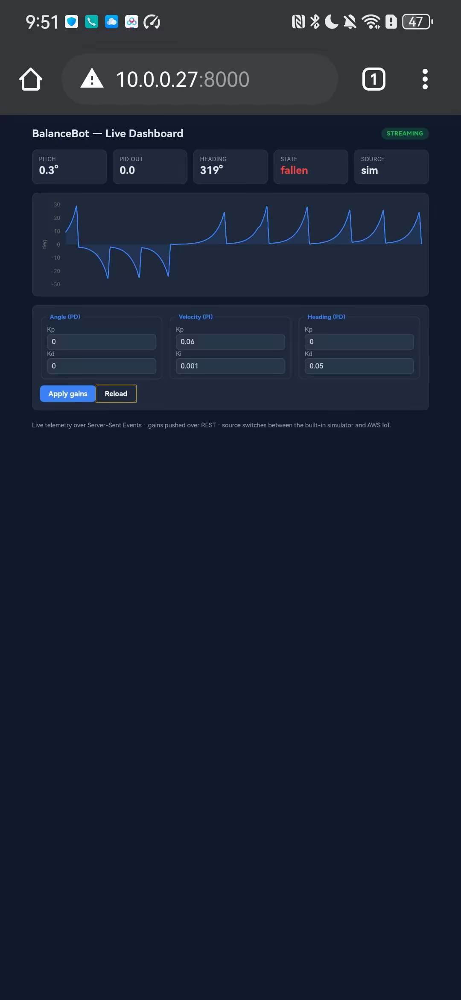

# BalanceBot-STM32

> A two-wheel **self-balancing robot**: the vendor's (XTARK) balancing controller ported to an STM32F103, plus a CC3200 build from my EEC 172 final project.

<!-- GitHub topics for search: self-balancing-robot, stm32, stm32f103, embedded-c, freertos, cc3200, firmware, robotics -->

Embedded-C firmware for a two-wheel **inverted-pendulum robot** that balances itself and drives over Bluetooth. The repo has two firmware builds for the same chassis. It also has companion software: a web telemetry dashboard with a **REST/SSE API**, and **Android & desktop** remote apps.


## Project provenance

This repository combines two related implementations on the same TARKBOT R3T chassis:

- The **STM32 build** and the companion apps are my personal project. The STM32 build starts from the balancing firmware of **XTARK**, the maker of the TARKBOT R3T chassis. Its control law is the vendor's, used verbatim.
- The **CC3200 build** began as the freely chosen design for my UC Davis EEC 172 (Embedded Systems) final project in Spring 2026. It focuses on Wi-Fi and AWS IoT alerts.

BalanceBot was not a prescribed EEC 172 assignment. The course final project was open-ended, and only the CC3200 build came from it.

The STM32 build runs XTARK's **cascaded controller**: an angle PD loop, a velocity PI loop and a turn PD loop. It runs at **100 Hz inside the MPU-6050's data-ready interrupt**, on the IMU's **on-chip DMP** output. I ported it from the vendor's OpenCTR board to an STM32F103C8T6 "Blue Pill" with hand-wired modules. The cart is driven and tuned by hand over Bluetooth, and the tuned gains are saved in internal flash.

---

## What I did

- **Port to new hardware** — moved the vendor's firmware from its OpenCTR board to the Blue Pill and adapted the IMU axis and motor signs for this cart. Wrote the **TB6612 motor driver** with two 20 kHz PWM channels.
- **Bluetooth commands** — replaced the vendor's framed Bluetooth protocol with **21 single-character commands** for driving and live gain tuning. An interrupt-fed ring buffer receives the bytes.
- **Flash-saved config** — rewrote the vendor's flash save. Nine values go to the last flash page with the valid marker written last, and a **read-back check** shows a failed save on the OLED.
- **Debugging on the cart** — found a **velocity-loop sign error** from six UART telemetry channels: a pushed cart sped up instead of braking. Fixed it with a sign setting that flips live and saves to flash.
- **Control fixes** — added **motor dead-zone compensation**, which removed a slow wobble that no PD gain could fix. Moved the wheel mix to 32-bit math so a large tilt can't wrap to full reverse.
- **Cold boot** — fixed boots where the IMU never started. The firmware now retries the IMU init up to 10 times and keeps the motors off until the DMP runs.
- **Ultrasonic sensor** — wrote an HC-SR04 driver timed by the DWT cycle counter. Wrote a scan-and-turn avoidance state machine that steers through the turn loop.
- **CC3200 build** *(EEC 172)* — bare-metal firmware with a Kalman tilt estimate and a fault state machine that stops the motors past 35°. On top of the course's Wi-Fi/TLS lab code, it posts an alert to an **AWS IoT Thing Shadow over HTTPS/TLS** at power-up and at most once per fall.
- **Companion software** — a **React/TypeScript** dashboard over a **Python REST/SSE API**, with a 20 Hz simulator and 8 automated API tests. A native **Android (Kotlin)** remote and a Python desktop remote send the Bluetooth drive commands.

---

## Two implementations

| Build | MCU | Highlights | Status |
|-------|-----|-----------|--------|
| [**STM32**](STM32/README.md) — *flagship* | STM32F103C8T6 "Blue Pill" (Cortex-M3, 72 MHz) | XTARK's controller, ported; Bluetooth remote with **live PID tuning**; flash-persisted config; dual OLED views | Balancing, remote & tuning verified on hardware |
| [**CC3200**](CC3200/README.md) | TI CC3200 (Cortex-M4 + Wi-Fi) | EEC 172 final project: angle PD loop on a Kalman tilt estimate, colour OLED, **Wi-Fi / AWS-IoT** alerts | Complete |

Both builds run on the same TARKBOT R3T chassis. The STM32 build runs XTARK's cascaded controller on the DMP's attitude output. The CC3200 build balances with my own angle PD loop on a Kalman tilt estimate.

### STM32 build — *flagship*

XTARK's balancing controller on a Blue Pill, with my motor driver and Bluetooth commands. **[Full details & build →](STM32/README.md)**

| Self-balancing + remote | OLED telemetry |
|:---:|:---:|
|  |  |


### CC3200 build

Kalman tilt estimate · colour OLED · **Wi-Fi / AWS-IoT** alerts on power-up and fall. **[Full details & build →](CC3200/README.md)** This firmware now has its own repository with host unit tests and CI: [cc3200-balancing-cart](https://github.com/ChenSiyun1234/cc3200-balancing-cart).

| Self-balancing | OLED telemetry |
|:---:|:---:|
|  |  |


---

## Companion software

The repo also has a small **software suite**: a native phone remote, a web dashboard with a REST/SSE API, and a desktop controller.

### Phone remote — Android · Kotlin

| Driving the real cart over Bluetooth | The app, connected to the HC-05 |
|:---:|:---:|
|  |  |

A native classic-Bluetooth **SPP** remote with a touch D-pad. Socket I/O runs off the UI thread. Hold a direction to drive, release to stop. **[Details & build →](android-app/README.md)**

### Web dashboard + REST / SSE API + AWS IoT

A browser dashboard shows telemetry over **Server-Sent Events** and sends PID-gain changes through a **REST API**. It has a **React / TypeScript** front end (plus a zero-build HTML/JS version) over a dependency-free **Python** service with 8 automated API tests. The data comes from a built-in 20 Hz simulator, or from an **AWS IoT Core** topic over MQTT through an optional adapter. AWS SAM and Serverless Framework templates describe a cloud backend on Lambda and DynamoDB; the SAM template also adds an IoT rule. The robot firmware uses AWS IoT in a different way: the CC3200 build POSTs its alerts to a Thing Shadow over HTTPS/TLS.

| Telemetry dashboard on a phone (simulator data) | Angle Kp dropped to 0: the simulated cart goes unstable |
|:---:|:---:|
|  |  |

**[Details & run →](companion-app/README.md)**

### Desktop controller — Python · Tkinter

Keyboard and on-screen control over a serial/Bluetooth link. A hardware-free simulation mode with a self-test lets it run without the robot. **[Details →](desktop-controller/README.md)**

---

## Control architecture

The control law is XTARK's, used verbatim in `STM32/Robot/ax_balance.c`. I adapted the IMU axis and motor signs for this cart. I also added the dead-zone compensation and the 32-bit output mix, and capped the two outer loops.

```
  MPU-6050 ──DMP──> pitch θ, rate ─────────> angle PD ───┐
  (accel+gyro)                                           │
                                                         ├─> Σ ─> dead-zone comp ─> ±3600 PWM ─> TB6612 ─> wheels
  encoders ──────> wheel speed ────────────> velocity PI ┤        (anti-overflow,
                                                         │         output clamp)
  gyro (yaw) ─────────────────────────────> turn PD ─────┘
                                                              ^
        the whole loop runs at 100 Hz inside the IMU ISR ─────┘
```

The **angle loop** keeps the cart upright. The **velocity loop** brakes a pushed cart and pulls it back toward where it started. The **turn loop** steers; it is off by default, and `T` turns it on. Remote commands and the avoidance logic only set the `vx`/`vw` targets; they never drive the motors directly.

---

## Tech stack

`C` · STM32F103 StdPeriph · FreeRTOS V9 · Keil µVision 5 / Arm Compiler 5 · MPU-6050 DMP · TB6612FNG · HC-05 · HC-SR04 · SSD1306
*(CC3200 build: TI SimpleLink SDK · AWS IoT · TLS · Code Composer Studio)*

---

## Hardware

Two firmware builds on the **TARKBOT R3T** chassis; the core parts are shared. Full parts list → **[hardware/BOM.en.md](hardware/BOM.en.md)**.

| Part | Role |
|------|------|
| STM32F103C8T6 "Blue Pill" | Main MCU (flagship) |
| TB6612 / MD220A driver + power board | Motor driver **and the cart's power hub** |
| MC130 encoder gear-motors ×2 | Drive + wheel-speed feedback |
| MPU-6050 (GY-521) | Tilt / attitude sensing (DMP) |
| SSD1306 OLED · HC-05 · HC-SR04 | Display · remote · ranging |
| 2S Li-ion ~7.4 V | One battery → MD220A powers all |

→ **Full bill of materials** (specs · indicative prices · buy links): **[hardware/BOM.en.md](hardware/BOM.en.md)**

---

## Repository

```
BalanceBot-STM32-CC3200/
├── STM32/        flagship firmware — Keil project + WIRING + TUNING guides
├── CC3200/       TI CCS firmware — Wi-Fi / AWS-IoT build
├── companion-app/       web dashboard + REST/SSE API + AWS serverless templates
├── android-app/         Android (Kotlin) remote app — Bluetooth SPP
├── desktop-controller/  Python desktop remote app (Tkinter + Bluetooth)
├── hardware/     bill of materials — BOM.en.md
├── tools/        diagram generators (pinout / schematic, Python)
└── README.md     (this file)
```

**Build docs:** **[STM32](STM32/README.md)** · **[CC3200](CC3200/README.md)** · **[Web app + API](companion-app/README.md)** · **[Android app](android-app/README.md)** · **[Desktop app](desktop-controller/README.md)** · **[Bill of materials](hardware/BOM.en.md)**

**Guides:** **[Wiring / hardware](STM32/WIRING.en.md)** · **[PID tuning](STM32/TUNING.en.md)**

---

## Acknowledgements

- **XTARK** (TARKBOT R3T): the STM32 control law is the vendor's balancing firmware, used verbatim in `STM32/Robot/ax_balance.c`, and the baseline gains came from it. The FreeRTOS task framework also comes from the vendor, and the files marked "adapted from XTARK OpenCTR" are based on the vendor's code.
- **EEC 172, UC Davis**: the CC3200 Wi-Fi/TLS code (`CC3200/src/network_utils.c/.h`) comes from the course's `aws-rest-api-ssl-demo` lab project, which builds on TI's SimpleLink SSL example. The CC3200 OLED graphics are **Adafruit GFX** as ported for the course.
- **Kristian Lauszus / TKJ Electronics**: the Kalman filter math in `CC3200/src/kalman.c` follows his KalmanFilter library (GPL-2.0).
- **Libraries**: FreeRTOS, ST's StdPeriph library, InvenSense's motion driver (DMP), and TI's CC3200 SDK.
- **License**: the MIT license in `LICENSE` covers my own code. XTARK's files and the other third-party code keep their owners' terms.
