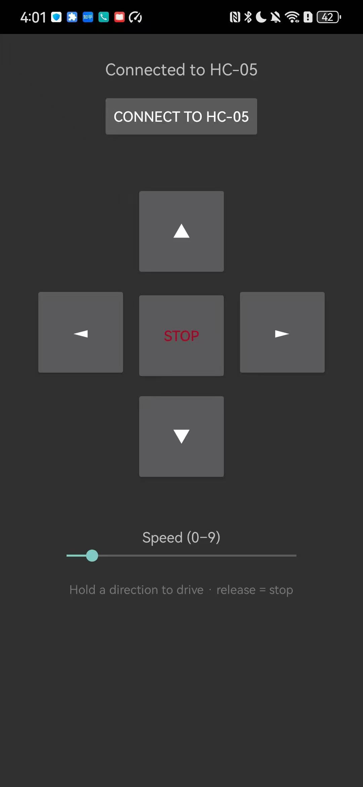

# BalanceBot Remote (Android)

A native Android (Kotlin) Bluetooth remote that drives the self-balancing two-wheel cart over a classic-Bluetooth HC-05 link, sending one-character drive commands with a press-and-hold D-pad.

## Overview

This sub-project is the mobile-software layer of the larger self-balancing robot. The full system is a three-layer stack:

```
hardware            firmware                         this app
+-----------+       +-----------------------+        +---------------------------+
| motors,   |  <--  | bare-metal STM32:     |  <--   | Android phone:            |
| encoders, | UART  | balance loop + UART   | SPP    | BalanceBot Remote (Kotlin)|
| HC-05,    |       | command parser on the | RFCOMM | classic-Bluetooth client  |
| IMU/MPU   |       | HC-05 serial line     |        |                           |
+-----------+       +-----------------------+        +---------------------------+
```

The firmware keeps the cart upright and listens for short ASCII commands on the HC-05 UART. This app is the remote: it pairs to the HC-05 as a classic-Bluetooth Serial Port Profile (SPP) device, opens an RFCOMM socket, and writes drive commands as the user holds direction buttons. It exists to round out the project with the complete hardware to firmware to mobile-software path, all written in Kotlin against the Android Bluetooth APIs.

The app is intentionally small and dependency-light: a single `Activity`, a single layout, and the platform Bluetooth stack. There is no third-party Bluetooth library, no ViewModel framework, and no networking dependency.

## Demo / Screenshots

| Driving the real cart over Bluetooth | App connected to the HC-05 |
|:---:|:---:|
|  |  |

Hold a direction to drive, release to stop.

## Features

- Press-and-hold D-pad. Holding a direction button sends one drive command on touch-down; releasing the button sends a STOP. This mirrors a physical RC remote: the cart only moves while a button is held.
- Classic-Bluetooth SPP / RFCOMM client. Connects to a bonded device named `HC-05` using `createRfcommSocketToServiceRecord` on the standard SPP UUID `00001101-0000-1000-8000-00805F9B34FB`.
- Runtime-permission handling across Android versions. On Android 12+ (API 31, `Build.VERSION_CODES.S`) it requests `BLUETOOTH_CONNECT`; on API 30 and below it falls back to the legacy `BLUETOOTH` and `BLUETOOTH_ADMIN` permissions.
- Off-UI-thread I/O. The blocking `connect()` call and every socket write run on a background `Thread`; status updates are marshalled back with `runOnUiThread`, so the UI never blocks on Bluetooth.
- Safety stops. A STOP command is sent on button release, on touch cancel, and again when the `Activity` is destroyed (`onDestroy`), so the cart does not keep rolling if the app is backgrounded or the touch is interrupted.
- Speed control. A `SeekBar` (range 0 to 9, default 5) sets a speed digit that is appended to every directional command.
- Live status line. A `TextView` reflects the current state: not connected, connecting, connected, permission needed, or the specific failure message.

## Architecture

### Components

- `MainActivity` (`com.siyun.balancebot.MainActivity`) holds all logic: permission flow, connection, command encoding, and the touch handlers.
- `activity_main.xml` defines the UI: a status `TextView`, a Connect `Button`, a 3-by-3 `GridLayout` D-pad (up / left / STOP / right / down), and the speed `SeekBar`.
- The Android Bluetooth platform classes (`BluetoothManager`, `BluetoothAdapter`, `BluetoothDevice`, `BluetoothSocket`) provide the SPP transport. No external Bluetooth dependency is used.

### Data flow

```
user touch (D-pad button)
        |
        v
bindHold() onTouchListener
   ACTION_DOWN  -> send(cmd)      cmd in {F, B, L, R}
   ACTION_UP    -> send('S')
   ACTION_CANCEL-> send('S')
        |
        v
send(cmd):  payload = (cmd == 'S') ? "S" : "<cmd><speed>"
        |
        v
background Thread -> OutputStream.write(payload as US-ASCII bytes)
        |
        v
BluetoothSocket (RFCOMM, SPP UUID)
        |
        v  classic Bluetooth radio
HC-05 module  -> STM32 UART -> firmware command parser
```

### Connection sequence

1. The user taps Connect to HC-05.
2. `ensurePermsThenConnect()` checks for the right permissions for the running OS version; if missing, it launches a `RequestMultiplePermissions` contract. On grant, it proceeds to `connect()`; on denial it shows "Bluetooth permission needed".
3. `connect()` reads the `BluetoothAdapter` from `BluetoothManager`. If Bluetooth is off or unavailable, it prompts the user to turn it on and pair the HC-05.
4. It searches `adapter.bondedDevices` for the first device whose name contains `HC-05` (case-insensitive). If none is found, it shows "HC-05 not found in paired devices".
5. On a background `Thread`, it calls `createRfcommSocketToServiceRecord(sppUuid)`, cancels discovery (`adapter.cancelDiscovery()` so an in-progress scan does not slow the connect), and calls the blocking `socket.connect()`.
6. On success it caches the socket and its `OutputStream` and updates the status to "Connected to HC-05". On failure it shows "Connect failed: <message>".

## Project layout

```
android-app/
  build.gradle                 Top-level build: declares AGP 8.5.2 and Kotlin 1.9.24 plugin versions
  settings.gradle              Root project name "BalanceBot Remote", includes :app, repositories
  gradle.properties            AndroidX on, non-transitive R class, official Kotlin code style, JVM args
  gradlew, gradlew.bat         Gradle wrapper launchers (Gradle 8.7)
  gradle/wrapper/              gradle-wrapper.jar + gradle-wrapper.properties (distributionUrl 8.7)
  local.properties             Local Android SDK path (machine-specific, not for sharing)
  docs/
    control_demo.gif           Phone app driving the real cart over Bluetooth
    app_connected.jpg          App showing "Connected to HC-05"
  app/
    build.gradle               Module build: namespace, compileSdk 34, minSdk 23, JVM 17, deps
    src/main/
      AndroidManifest.xml      Bluetooth permissions, bluetooth hardware feature, launcher activity
      java/com/siyun/balancebot/
        MainActivity.kt        All app logic (permissions, connect, command send, touch handlers)
      res/layout/
        activity_main.xml      UI: status text, Connect button, D-pad grid, speed seekbar
```

Note: `build/` output and `local.properties` are intentionally not part of the documented, shareable set.

## Command-protocol reference

The app speaks the firmware's HC-05 command set: short ASCII strings written directly to the RFCOMM `OutputStream`. There is no acknowledgement or response read back; the channel is one-way write from app to cart.

### Encoding rule

From `send(cmd)`:

```
payload = if (cmd == 'S') "S" else "<cmd><speed>"
bytes   = payload.toByteArray(Charsets.US_ASCII)
```

- A directional command is the direction character followed immediately by a single speed digit.
- A STOP is the single character `S` with no speed digit.
- `<speed>` is the current `SeekBar` value, an integer 0 to 9 (default 5).

### Command characters

| Source | Character | Meaning | Example payload (speed 5) |
|:---|:---:|:---|:---|
| `btnFwd` hold | `F` | Forward | `F5` |
| `btnBack` hold | `B` | Back | `B5` |
| `btnLeft` hold | `L` | Left | `L5` |
| `btnRight` hold | `R` | Right | `R5` |
| `btnStop` tap, button release, cancel, onDestroy | `S` | Stop | `S` |

### When each command is emitted

- On D-pad button touch-down (`MotionEvent.ACTION_DOWN`): the direction character plus speed digit, for example `F5`.
- On D-pad button release (`ACTION_UP`) or touch cancel (`ACTION_CANCEL`): `S`.
- On the dedicated STOP button tap: `S`.
- On `Activity` destruction (`onDestroy`): `S` (written as a final safety stop before the socket is closed).

A typical hold-and-release at speed 7 produces the byte sequence `F7` (on press) then `S` (on release).

## Build and Run

This is a complete, self-contained Gradle project with a committed wrapper, so no manual project bootstrapping is needed.

Toolchain (per the build scripts):

- Android Gradle Plugin 8.5.2 (`build.gradle`)
- Kotlin Android plugin 1.9.24 (`build.gradle`)
- Gradle 8.7 (`gradle/wrapper/gradle-wrapper.properties`)
- `compileSdk 34`, `targetSdk 34`, `minSdk 23` (`app/build.gradle`)
- JDK 17 source/target and Kotlin `jvmTarget 17` (`app/build.gradle`)

### Prerequisites

- JDK 17 on `PATH`.
- Android SDK with platform 34 and build-tools 34 installed.
- `local.properties` pointing at your SDK, for example `sdk.dir=C:\\Users\\you\\AppData\\Local\\Android\\Sdk` (Android Studio creates this for you on first open).

### Command line

macOS / Linux:

```bash
cd android-app
./gradlew assembleDebug
# output: app/build/outputs/apk/debug/app-debug.apk
```

Windows (PowerShell or cmd):

```bat
cd android-app
.\gradlew.bat assembleDebug
:: output: app\build\outputs\apk\debug\app-debug.apk
```

### Android Studio

1. File, Open, then select the `android-app/` folder (open the sub-project directory, not the repository root).
2. Let Gradle sync finish.
3. Choose a connected device or emulator and click Run.

### Install on a phone

With the debug APK built:

```bash
adb install -r app/build/outputs/apk/debug/app-debug.apk
```

Alternatively, copy `app-debug.apk` onto the phone and tap it to install, enabling "install unknown apps" for the file manager when prompted.

## Configuration / options

The app deliberately exposes only what it needs. The configurable points in source are:

- Target module name: `hc05Name` in `MainActivity.kt` (default `"HC-05"`). The match is case-insensitive and uses `contains`, so any bonded device whose name includes this string is selected. Change this if your module is renamed.
- SPP UUID: `sppUuid` in `MainActivity.kt` (`00001101-0000-1000-8000-00805F9B34FB`). This is the standard serial-port UUID for HC-05 and similar classic-Bluetooth serial modules; you should not normally change it.
- Default speed: the `speed` field starts at 5 and the `SeekBar` `android:progress` is 5; its `android:max` is 9. Adjust the layout attributes in `activity_main.xml` to change the range or default.
- Application id and version: `applicationId "com.siyun.balancebot"`, `versionCode 1`, `versionName "1.0"` in `app/build.gradle`.

There are no build flavors, no environment files, and no runtime flags beyond the on-screen controls.

## Testing

This project ships no automated unit or instrumentation test suite; verification is done on hardware. To confirm the build and behavior:

1. Build verification: run `./gradlew assembleDebug` and confirm `app/build/outputs/apk/debug/app-debug.apk` is produced without errors.
2. Manual end-to-end check (requires the cart powered on and its HC-05 paired):
   - Open the app and confirm the status reads "Not connected".
   - Tap Connect to HC-05 and confirm the status progresses to "Connecting to HC-05..." then "Connected to HC-05".
   - Hold the forward arrow and confirm the cart drives forward; release and confirm it stops.
   - Repeat for back, left, and right; confirm the speed slider changes how fast it drives.
   - Background or close the app while driving and confirm the cart stops (the `onDestroy` safety STOP).

Status: verified on the real self-balancing cart over the HC-05 link (see the Demo section).

## Install and pairing specifics

1. Power on the cart so the HC-05 is advertising.
2. In the phone's system Bluetooth settings, pair with the HC-05 (default PIN for most HC-05 units is `1234` or `0000`; this is set on the module, not in this app). Pairing must be done in system settings; the app only connects to already-bonded devices.
3. Launch BalanceBot Remote.
4. Tap Connect to HC-05 and grant the Bluetooth permission when prompted.
5. Once the status shows "Connected to HC-05", hold the D-pad arrows to drive.

The launcher label is "BalanceBot Remote" (`android:label` in the manifest). The app declares `uses-feature android.hardware.bluetooth` as required, so devices without Bluetooth are filtered out on stores that honor it.

## Troubleshooting

| Symptom (status text or behavior) | Likely cause | Fix |
|:---|:---|:---|
| "Bluetooth permission needed" | Permission denied in the system dialog | Re-tap Connect and allow Bluetooth, or grant the Nearby devices / Bluetooth permission in App info. On Android 12+ this is `BLUETOOTH_CONNECT`. |
| "Turn on Bluetooth and pair the HC-05 first" | Bluetooth is off, or no adapter | Enable Bluetooth in system settings, then retry. |
| "HC-05 not found in paired devices" | Module not bonded, or named differently | Pair the HC-05 in system Bluetooth settings first. If your module is renamed, update `hc05Name` in `MainActivity.kt`. |
| "Connect failed: ..." | Module busy, out of range, powered off, or another phone is already connected | Power-cycle the HC-05, move closer, ensure no other device holds the connection, then retry. The connect runs off the UI thread, so the app stays responsive while it retries. |
| "Send failed: ..." | Connection dropped after connecting | Tap Connect to HC-05 again to re-establish the socket. |
| "Not connected" when pressing a direction | No socket yet (you have not connected, or the connection was lost) | Connect first; the D-pad only writes once `output` is non-null. |
| Cart keeps moving after release | Lost commands or firmware-side issue | The app sends `S` on release, cancel, and `onDestroy`; if motion persists, check the firmware UART parser and the HC-05 wiring on the cart side. |
| Build fails with SDK location not found | `local.properties` missing or wrong | Open once in Android Studio to generate it, or create it with `sdk.dir=<path-to-Android-Sdk>`. |
| Build fails on Java version | Wrong JDK | Use JDK 17; the module targets `JavaVersion.VERSION_17` and Kotlin `jvmTarget 17`. |

## Tech stack

- Language: Kotlin 1.9.24
- UI: Android View system (XML layout, `AppCompatActivity`); theme `Theme.AppCompat.DayNight.NoActionBar`
- Bluetooth: Android classic-Bluetooth platform APIs (`BluetoothManager`, `BluetoothAdapter`, `BluetoothDevice`, `BluetoothSocket`), SPP / RFCOMM, UUID `00001101-0000-1000-8000-00805F9B34FB`
- Concurrency: plain `java.lang.Thread` for off-UI-thread connect and writes, `runOnUiThread` for UI updates
- Permissions: Activity Result `RequestMultiplePermissions` contract; `BLUETOOTH_CONNECT` on API 31+, `BLUETOOTH` and `BLUETOOTH_ADMIN` on API 30 and below
- Dependencies: `androidx.core:core-ktx:1.13.1`, `androidx.appcompat:appcompat:1.7.0`
- Build: Gradle 8.7 with the Gradle wrapper, Android Gradle Plugin 8.5.2, `compileSdk 34` / `targetSdk 34` / `minSdk 23`, JDK 17
- Application id: `com.siyun.balancebot`
