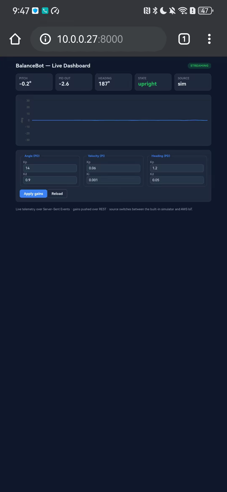
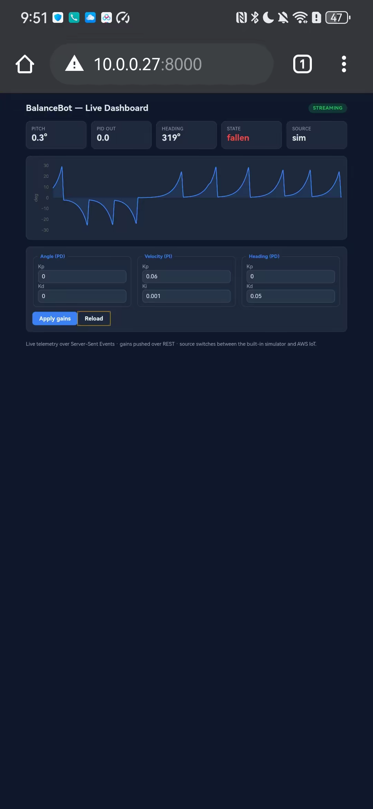

# BalanceBot Companion App

A dependency-free, full-stack web companion for the self-balancing cart: a live telemetry dashboard, a hand-rolled REST + Server-Sent-Events API written entirely in the Python standard library, a hardware-free physics simulator, an AWS IoT Core path to the real robot, and Infrastructure-as-Code for a serverless deployment.

---

## Overview

This sub-project is the **software / web / cloud layer** that sits on top of the embedded self-balancing-cart project. The larger system is a three-tier stack:

```
   hardware  ----------->  firmware  ----------->  software (this directory)
   (motors, IMU, MCU)      (STM32 / CC3200)        (companion-app/)
```

The firmware running on the cart's microcontroller closes a cascaded PID loop (an inner angle/attitude PD loop, an outer velocity PI loop, and a heading PD loop) to keep the cart upright. The CC3200 build publishes its state to **AWS IoT Core** over MQTT/TLS. This companion app **watches and tunes that loop from a browser**: it streams the cart's live telemetry to a dashboard and lets you push new PID gains back down to it over the same AWS IoT path the firmware already uses.

The defining design constraint is that the **entire app runs with zero hardware and zero cloud credentials**. A built-in inverted-pendulum simulator (`telemetry.SimSource`) stands in for the real robot, so the dashboard, API, and tests can be developed, demoed, and run offline. Switching to the live robot is a single command-line flag (`--source aws`).

Sister directories in the parent repository hold the embedded firmware (`STM32/`, `CC3200/`); this directory is everything above the metal.

---

## Demo / Screenshots

Served by `python -m api.server` on a laptop and opened on an Android phone over Wi-Fi at `http://<laptop-ip>:8000`. The dashboard is responsive and works from any browser on the network.

| Balancing (Angle Kp = 14) | Unstable (Angle Kp = 0) |
|:---:|:---:|
|  |  |

Dropping the **Angle Kp** gain to 0 from the phone is sent to the API over `POST /api/pid`. The simulator immediately destabilises: the sawtooth pitch trace is the cart repeatedly toppling past the 30-degree fall threshold and auto-re-righting, and the **State** card flips from `upright` to `fallen`. That is the full round trip:

```
phone (POST /api/pid)  ->  REST  ->  RobotState gains  ->  SimSource physics
   ->  Telemetry  ->  /api/stream (SSE)  ->  phone (chart + State card)
```

---

## Features

- **Dependency-free Python backend.** The dev server (`api/server.py`) is built on `http.server.ThreadingHTTPServer` from the standard library. No Flask, no FastAPI, no `pip install` required to run or test it.
- **REST + Server-Sent Events API.** Read/write PID gains over REST; receive live telemetry as a `text/event-stream`. CORS headers and `OPTIONS` preflight are handled so the React dev server (different origin) can talk to it.
- **Hardware-free simulator.** `telemetry.SimSource` is an inverted-pendulum model that reacts to the live gains in real time, so live tuning is visible: raise the angle gains and the cart settles, drop them and it diverges and "falls".
- **Live AWS IoT Core path.** `api/iot.py` subscribes to the robot's telemetry topic and publishes gain commands back, mirroring the CC3200 firmware. `paho-mqtt` is an optional dependency, loaded lazily only when `--source aws` is selected.
- **Two front-ends, one backend.** A **buildless** vanilla-JS dashboard (`web/`, Chart.js via CDN) that runs straight from the Python server with no toolchain, and an equivalent **React + TypeScript** app (`web-react/`, Vite) that proxies `/api` to the same backend.
- **Input validation.** PID-gain updates are validated server-side: only known keys, finite numbers, and a `[0, 1000]` range are accepted; anything else returns `400` with an error message.
- **Infrastructure-as-Code.** Two equivalent serverless definitions (AWS SAM `deploy/template.yaml` and Serverless Framework `deploy/serverless.yml`) provision a Lambda + DynamoDB table + an IoT TopicRule.
- **Integration test suite.** `api/tests/test_api.py` boots the real server on an ephemeral port and exercises the HTTP surface end to end, using only the standard library.

---

## Architecture

The shared `RobotState` object (in `api/telemetry.py`) is the hub. A **source** writes telemetry into it; the **HTTP handler** reads from it. The two sources (`SimSource` and `AwsIotSource`) are interchangeable, selected at startup by `--source`.

```
   +-------------+   MQTT/TLS    +--------------------+   SSE + REST   +----------------+
   |  BalanceBot |  -----------> |  Python API        |  ------------> |  Web dashboard |
   |  (CC3200,   |   AWS IoT     |  (stdlib only)     |  /api/stream   |  web/  or      |
   |   Wi-Fi)    |  <----------- |  server.py         |  /api/pid      |  web-react/    |
   +-------------+   PID cmds    +--------------------+                +----------------+
                                          ^
                                          |  default: no hardware
                                   +--------------+
                                   |  SimSource   |   inverted-pendulum simulator
                                   +--------------+
```

Data flow in the default (simulator) configuration:

1. `SimSource` runs as a background thread at 20 Hz. Each tick it reads the current gains from `RobotState`, advances a simple pendulum-plus-PD-control model, and pushes a `Telemetry` sample back into `RobotState` (latest sample + a 240-entry history deque).
2. A browser opens the dashboard and subscribes to `GET /api/stream`. The handler loops, reading the latest sample from `RobotState` every 100 ms and emitting it as an SSE `data:` frame.
3. The user edits a gain and submits. The front-end sends `POST /api/pid`; the handler validates the payload, merges it into `RobotState`, and (if the source supports it) publishes the new gains downstream. The simulator picks up the new gains on its next tick, closing the loop.

In live mode, `AwsIotSource` replaces `SimSource`: incoming MQTT messages on `balancebot/telemetry` become `Telemetry` samples, and `POST /api/pid` is additionally published to `balancebot/cmd/pid` for the real robot to adopt.

---

## Project layout

```
companion-app/
  api/
    server.py             stdlib HTTP server: routing, REST, SSE, static file serving
    telemetry.py          Telemetry dataclass, RobotState, validate_gains, SimSource
    iot.py                AwsIotSource: AWS IoT Core MQTT subscribe/publish (paho-mqtt)
    __init__.py
    tests/
      test_api.py         integration tests against the live server (8 tests)
      __init__.py
  web/                    buildless dashboard (no toolchain)
    index.html            markup; loads Chart.js from CDN
    app.js                vanilla JS: SSE client, chart, PID form
    styles.css
  web-react/              React + TypeScript dashboard (Vite)
    src/
      App.tsx             root component; owns SSE connection and state
      api.ts              getGains / setGains REST helpers
      types.ts            Telemetry and PidGains interfaces
      components/
        PidForm.tsx       controlled PID-gain form
        Sparkline.tsx     pitch-history sparkline
      main.tsx
      styles.css
    vite.config.ts        dev server config; proxies /api -> http://127.0.0.1:8000
    package.json
    dist/                 build output (vite build)
  deploy/                 Infrastructure-as-Code (serverless)
    template.yaml         AWS SAM template (Lambda + DynamoDB SimpleTable + IoT rule)
    serverless.yml        Serverless Framework equivalent
    lambda_handler.py     Lambda handler backing both IaC definitions
  docs/
    screenshots/Website_onphone/   demo screenshots
  README.md
```

---

## API / command-protocol reference

All endpoints are served from the same origin as the dashboard. The dev server defaults to `http://127.0.0.1:8000`. Responses are JSON unless noted; CORS is open (`Access-Control-Allow-Origin: *`).

| Method | Path             | Description                                                       |
|--------|------------------|-------------------------------------------------------------------|
| GET    | `/api/health`    | Service health and active source: `{"status":"ok","source":"sim"\|"aws-iot"}` |
| GET    | `/api/pid`       | Current PID gains (all six keys)                                  |
| POST   | `/api/pid`       | Validate and apply a (partial) gain update; `400` on bad input    |
| GET    | `/api/telemetry` | Latest telemetry sample (`{}` if none yet)                        |
| GET    | `/api/history`   | Recent telemetry samples as a JSON array (for first paint)        |
| GET    | `/api/stream`    | `text/event-stream` of live telemetry (Server-Sent Events)        |
| GET    | `/`, `/<file>`   | Static assets from `web/` (`index.html` at `/`)                   |
| OPTIONS| any              | CORS preflight; returns `204`                                     |

### Telemetry sample shape

Returned by `/api/telemetry`, the elements of `/api/history`, and each SSE frame. Produced by the `Telemetry` dataclass in `api/telemetry.py`:

```json
{
  "ts": 1718900000.123,
  "pitch_deg": 1.84,
  "velocity": -0.21,
  "heading_deg": 137.4,
  "pid_output": 25.7,
  "upright": true,
  "source": "sim"
}
```

- `pitch_deg` — body tilt; the balance loop drives this toward 0. The simulator flags `upright: false` once `abs(pitch_deg)` exceeds 30 degrees.
- `pid_output` — motor command after the cascaded loop, clamped to `[-100, 100]`.
- `source` — `"sim"` or `"aws-iot"`.

### PID gains

The six gains, with the firmware-mirroring defaults from `DEFAULT_GAINS`:

| Key          | Loop          | Default |
|--------------|---------------|---------|
| `angle_kp`   | Angle (PD)    | 14.0    |
| `angle_kd`   | Angle (PD)    | 0.9     |
| `vel_kp`     | Velocity (PI) | 0.06    |
| `vel_ki`     | Velocity (PI) | 0.001   |
| `heading_kp` | Heading (PD)  | 1.2     |
| `heading_kd` | Heading (PD)  | 0.05    |

### Example requests

Read the current gains:

```bash
curl http://127.0.0.1:8000/api/pid
```

```json
{"angle_kp": 14.0, "angle_kd": 0.9, "vel_kp": 0.06, "vel_ki": 0.001, "heading_kp": 1.2, "heading_kd": 0.05}
```

Apply a partial update (only the supplied keys change; the response is the full merged gain set):

```bash
curl -X POST http://127.0.0.1:8000/api/pid \
  -H "Content-Type: application/json" \
  -d '{"angle_kp": 22.5}'
```

```json
{"angle_kp": 22.5, "angle_kd": 0.9, "vel_kp": 0.06, "vel_ki": 0.001, "heading_kp": 1.2, "heading_kd": 0.05}
```

Validation failures return `400` with an error message (see `validate_gains`):

```bash
curl -i -X POST http://127.0.0.1:8000/api/pid -d '{"nope": 1.0}'
# HTTP/1.1 400 Bad Request
# {"error": "unknown gain 'nope'"}
```

Rejections include: payload that is not a JSON object, an unknown gain key, a non-numeric value, and a value that is non-finite or outside `[0, 1000]`.

Subscribe to the live telemetry stream (each frame is a `data:` line followed by a blank line, emitted roughly every 100 ms):

```bash
curl -N http://127.0.0.1:8000/api/stream
# data: {"ts": 1718900000.123, "pitch_deg": 1.84, ...}
#
# data: {"ts": 1718900000.223, "pitch_deg": 1.91, ...}
#
```

### MQTT topics (live mode)

When `--source aws` is active, `api/iot.py` uses:

- `balancebot/telemetry` — subscribed; inbound robot telemetry (JSON, same field names as the telemetry sample above).
- `balancebot/cmd/pid` — published with QoS 1 on every accepted `POST /api/pid`; outbound gain commands for the robot to adopt.

---

## Build & Run

All commands are run from the `companion-app/` directory.

### 1. Run the dashboard (no hardware, no install)

Requires only Python 3 (the type hints use `from __future__ import annotations`, so 3.7+ works; the serverless runtime targets 3.12).

```bash
cd companion-app
python -m api.server
```

This starts the simulator and serves the buildless dashboard at `http://127.0.0.1:8000`. Open it in a browser: you will see live (simulated) telemetry. Lower the **Angle Kp** gain and apply to watch the cart wobble and fall; raise it and it settles.

To make the dashboard reachable from other devices on the network (for example the phone demo above), bind to all interfaces:

```bash
python -m api.server --host 0.0.0.0 --port 8000
```

Then open `http://<this-machine-ip>:8000` from the phone.

### 2. Live mode (real robot, via AWS IoT Core)

```bash
pip install paho-mqtt
python -m api.server --source aws \
  --endpoint <id>-ats.iot.<region>.amazonaws.com \
  --ca AmazonRootCA1.pem \
  --cert device.pem.crt \
  --key private.pem.key
```

`paho-mqtt` is imported lazily, so it is only needed for this path. If `--source aws` is given without all of `--endpoint`, `--ca`, `--cert`, and `--key`, the server exits with a message listing the missing flags.

### 3. React / TypeScript dashboard

Requires Node.js. Run the Python API in one terminal (it provides the backend), and the Vite dev server in another:

```bash
# terminal 1
cd companion-app
python -m api.server

# terminal 2
cd companion-app/web-react
npm install
npm run dev
```

Vite proxies `/api` to `http://127.0.0.1:8000` (see `vite.config.ts`), so the React app talks to exactly the same backend as the buildless version. To produce a static build:

```bash
npm run build        # tsc + vite build -> web-react/dist/
npm run preview      # serve the production build locally
```

---

## Configuration / options

`python -m api.server` flags (defined in `main()` in `api/server.py`):

| Flag         | Default       | Purpose                                                  |
|--------------|---------------|----------------------------------------------------------|
| `--host`     | `127.0.0.1`   | Bind address (use `0.0.0.0` to expose on the LAN)        |
| `--port`     | `8000`        | TCP port                                                 |
| `--source`   | `sim`         | Telemetry source: `sim` (built-in) or `aws` (AWS IoT)    |
| `--endpoint` | (none)        | AWS IoT Core ATS endpoint; required for `--source aws`   |
| `--ca`       | (none)        | Root CA certificate path; required for `--source aws`    |
| `--cert`     | (none)        | Device certificate path; required for `--source aws`     |
| `--key`      | (none)        | Device private key path; required for `--source aws`     |

Other tunables live in code:

- `DEFAULT_GAINS` (`api/telemetry.py`) — starting PID gains, mirroring the firmware.
- `RobotState(history=240)` — number of telemetry samples retained for `/api/history`.
- `SimSource(rate_hz=20.0)` — simulator tick rate.
- `TELEMETRY_TOPIC` / `COMMAND_TOPIC` (`api/iot.py`) — MQTT topic names.
- `GAINS_TABLE` env var (deploy) — DynamoDB table name read by `lambda_handler.py`.

---

## Testing

The suite in `api/tests/test_api.py` is an integration test: it starts the real stdlib server on an ephemeral port (`port=0`) with the simulator as the source, waits for `/api/health` to return `200`, then exercises the HTTP surface with `urllib`. It uses only the standard library, so no extra install is needed.

```bash
cd companion-app
python -m unittest api.tests.test_api -v
```

The eight tests cover: health endpoint and reported source, `GET /api/pid` returning all gains, a persisted partial `POST /api/pid` update, the three validation rejections (unknown key, non-numeric value, out-of-range value), telemetry actually streaming from the simulator, and the static dashboard being served at `/`.

The Lambda handler (`deploy/lambda_handler.py`) is deliberately importable without `boto3` (it falls back to `_table = None`), which keeps it unit-testable locally.

---

## Deployment

Two equivalent Infrastructure-as-Code definitions live in `deploy/`. Both target the same architecture: an HTTP API on Lambda for the PID gains, a DynamoDB table for persistence, and an AWS IoT TopicRule that forwards every robot telemetry message into the same Lambda. `lambda_handler.handler` backs both.

### Option A: AWS SAM (`deploy/template.yaml`)

Provisions:

- `GainsTable` — a DynamoDB SimpleTable keyed on `id`.
- `ApiFunction` — Python 3.12 Lambda (`lambda_handler.handler`), wired to `GET` and `POST /api/pid` via an HTTP API, with `DynamoDBCrudPolicy` scoped to the table.
- `TelemetryRule` — an IoT TopicRule on `SELECT * FROM 'balancebot/telemetry'` that invokes the Lambda, plus the `lambda:InvokeFunction` permission for `iot.amazonaws.com`.
- Output `ApiBaseUrl` — the deployed HTTP API base URL.

```bash
cd companion-app/deploy
sam build
sam deploy --guided
```

### Option B: Serverless Framework (`deploy/serverless.yml`)

The same service (`balancebot-companion`) on Python 3.12 in `us-west-2`, with a `PAY_PER_REQUEST` DynamoDB table and scoped `dynamodb:GetItem` / `dynamodb:PutItem` IAM statements.

```bash
cd companion-app/deploy
serverless deploy
```

### Lambda routing

`lambda_handler.handler` distinguishes invocations by the presence of an HTTP method in the event:

- No HTTP method present means the IoT TopicRule invoked it with a telemetry payload, which is stored under item id `telemetry`.
- `GET` returns the gains from DynamoDB (item id `gains`), falling back to `DEFAULTS` for any missing key.
- `POST` validates and persists the merged gains; bad input returns `400`.
- Any other method returns `405`.

Note: the handler stores gains as strings; a code comment flags that production code would use DynamoDB `Decimal` rather than `float`/`str`.

---

## Troubleshooting

- **`ModuleNotFoundError: No module named 'api'`** — the server is run as a package (`python -m api.server`) and the tests import `api.*`. Run both from inside the `companion-app/` directory so `api/` is on the path.
- **`--source aws requires: --endpoint, --ca, ...`** — live mode needs all four of `--endpoint`, `--ca`, `--cert`, `--key`. The server names whichever are missing and exits.
- **`paho-mqtt is not installed`** — `--source aws` needs the optional MQTT client. Run `pip install paho-mqtt`, or drop `--source aws` to fall back to the simulator.
- **Dashboard shows "disconnected" / no live data** — the SSE stream (`/api/stream`) was interrupted. The browser `EventSource` auto-reconnects; if it persists, confirm the server is running and reachable, and that nothing (proxy, firewall) is buffering `text/event-stream`.
- **Phone cannot reach the dashboard** — by default the server binds to `127.0.0.1` (localhost only). Start it with `--host 0.0.0.0`, ensure the phone is on the same network, and open `http://<laptop-ip>:8000`. A host firewall may also need to allow inbound TCP on the port.
- **React app gets 404s on `/api/*`** — the Python backend must be running on `127.0.0.1:8000` for Vite's proxy to forward to it. Start `python -m api.server` before `npm run dev`.
- **`POST /api/pid` returns 400** — the payload failed validation. Send a JSON object whose keys are among the six known gains, with finite numeric values in `[0, 1000]`.
- **Gains apply on the dashboard but the real robot does not react** — in live mode the publish to `balancebot/cmd/pid` is best-effort: a publish failure is swallowed so the dashboard still reflects the change locally. Check the MQTT connection, credentials, and that the robot subscribes to the command topic.

---

## Tech stack

- **Backend:** Python 3 standard library only (`http.server`, `json`, `argparse`, `threading`, `dataclasses`, `urllib`); `unittest` for tests.
- **Live cloud path:** AWS IoT Core (MQTT over TLS) via `paho-mqtt` (optional dependency).
- **Front-end (buildless):** HTML + CSS + vanilla JavaScript, Chart.js 4 loaded from CDN, `EventSource` for SSE.
- **Front-end (React):** React 18 + TypeScript 5, built with Vite 5 (`@vitejs/plugin-react`).
- **Deployment:** AWS SAM and Serverless Framework, targeting AWS Lambda (Python 3.12), DynamoDB, and an AWS IoT TopicRule.

---

## 中文简介

本目录是自平衡小车的**配套全栈应用**：把小车的实时遥测推送到网页仪表盘，并能在网页上
在线调 PID 参数，走的是 CC3200 固件已有的 **AWS IoT** 链路。内置仿真器，**无需硬件、
无需云凭证**即可运行、演示与测试。

整套系统分三层：硬件（电机、IMU、单片机）-> 固件（STM32 / CC3200，闭合级联 PID 控制
回路）-> 软件（本目录），本目录即最上层的软件 / 网页 / 云端层。

- `api/` 纯标准库 Python 服务（REST + SSE，零依赖）：`server.py` 提供接口与静态页面，
  `telemetry.py` 是遥测模型、共享状态与仿真器 `SimSource`，`iot.py` 是 AWS IoT 实时链路。
- `web/` 免构建网页仪表盘（HTML/CSS/JS，Chart.js 走 CDN）；`web-react/` 同款 React +
  TypeScript 版本（Vite）。
- `deploy/` AWS SAM（`template.yaml`）与 Serverless Framework（`serverless.yml`）两套
  无服务器部署配置，对应 Lambda + DynamoDB + IoT TopicRule，由 `lambda_handler.py` 承载。

运行：`cd companion-app && python -m api.server`，浏览器打开 <http://127.0.0.1:8000>。
测试：`python -m unittest api.tests.test_api -v`。
